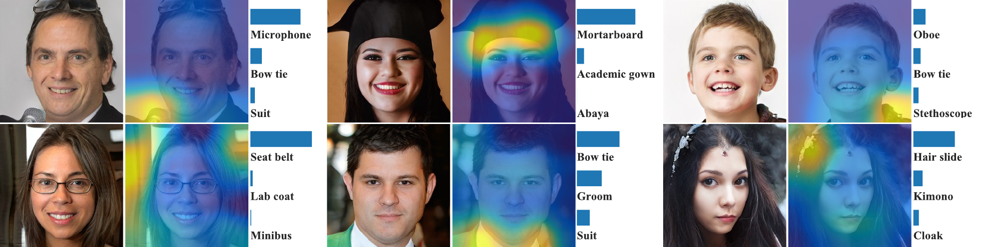

# The Role of ImageNet Classes in Fréchet Inception Distance

<figure>
    <p align="center">
        
        <br>
    </p>
</figure>

**The Role of ImageNet Classes in Fréchet Inception Distance**<br>
Tuomas Kynkäänniemi, Tero Karras, Miika Aittala, Timo Aila, Jaakko Lehtinen<br>

[Paper (arXiv)](https://arxiv.org/abs/2203.06026)

Abstract: *Fréchet Inception Distance (FID) is the primary metric for ranking models in data-driven generative modelling. While remarkably successful, the metric is known to disagree with human judgement in many cases. We investigate a root cause of these discrepancies, and elucidate the role of ImageNet classes in FID. We show that the feature space FID is (typically) computed in is so close to the ImageNet classifications that aligning the histograms of Top-$N$ classifications between sets of generated and real images can reduce FID very substantially --- without actually improving the quality of results. Thus we conclude that FID prone to intentional or accidental distortions. As this attack has only a minor effect on the generated set of images, we conclude that FID has a large perceptual null space, and is therefore prone to intentional or accidental distortions. As a practical example of an accidental distortion, we explain a case where an ImageNet pre-trained FastGAN achieves a FID comparable to StyleGAN2, while being worse in terms of human evaluation.*

## Setup and requirements

We recommend using [Anaconda](https://www.anaconda.com/). To create a virtual environment and install required packages run:

```
conda env create -f environment.yml
conda activate imagenet-classes-in-fid
```

## Usage

This repository provides code for reproducing FID sensitivity heatmaps for individual images (Sec. 2.2) and probing the perceptual null space of FID by resampling features (Sec. 3.1-3.2).

To run the below code examples, you first need to prepare or [download](https://drive.google.com/drive/u/1/folders/1WPrdPC1DlnsxLWgXTE64qsriCCcxve5y) the `256x256` resolution FFHQ dataset in ZIP format. Help for preparing the dataset can found [here](https://github.com/NVlabs/stylegan2-ada-pytorch). If automatic downloading of network pickles from Google Drive fails they can be manually downloaded from [here](https://drive.google.com/drive/folders/1WPrdPC1DlnsxLWgXTE64qsriCCcxve5y?usp=sharing).

### Sensitivity heatmaps

FID sensitivity heatmaps for StyleGAN2-generated images in FFHQ (Fig. 3) can be generated with:

```
python generate_heatmaps.py --zip_path=data_path \
  --network_pkl=https://drive.google.com/uc?id=119HvnQ5nwHl0_vUTEFWQNk4bwYjoXTrC \
  --seeds=[107,540,386,780,544,879]
```

Running the command takes approximately 8 minutes with an NVIDIA Titan V GPU. Reference sensitivity heatmaps can be found from [here](https://drive.google.com/drive/folders/1KoXeO6CX5-wvaJEkalzVuv25Y9RAj9l9?usp=sharing). See `python generate_heatmaps.py --help` for more options.

### Resampling features

Note: Running this requires a GPU with at least 26 GB of memory. All fringe features of StyleGAN2-generated images in FFHQ can be matched with:

```
python run_resampling.py --zip_path=data_path \
  --network_pkl=https://drive.google.com/uc?id=119HvnQ5nwHl0_vUTEFWQNk4bwYjoXTrC \
  --feature_mode=pre_logits
```

This command can be used to replicate FFHQ pre-logits resampling results from Tab. 2. Reference output is (numbers may vary slightly):

```
It. 1/100000, loss = 4.95917
FID = 5.25
CLIP-FID = 2.75
Elapsed time: 154.13s

It. 500/100000, loss = 3.61191
FID = 3.96
CLIP-FID = 2.69
Elapsed time: 1789.39s
```

Additionally, resampling can be run in four different modes: `pre_logits`, `logits`, `top_n`, and `middle_n`. These modes respectively match all fringe features, Inception-V3 logits, Top-N classes, and Middle-N classes between real and generated images. See `python run_resampling.py --help` for more options.

## License

The code of this repository is released under the [CC BY-NC-SA 4.0](https://github.com/kynkaat/role-of-imagenet-classes-in-fid/master/LICENSE) license. This repository adapts code from [StyleGAN2](https://github.com/NVlabs/stylegan2), [StyleGAN2-ADA](https://github.com/NVlabs/stylegan2-ada-pytorch), and [PyTorch Grad-CAM](https://github.com/jacobgil/pytorch-grad-cam) which are released under NVIDIA Source Code License and MIT License, respectively. The `clip-vit_b32.pkl` is derived from the pre-trained [CLIP ViT-B/32](https://arxiv.org/abs/2103.00020) by OpenAI which is originally shared under MIT License in GitHub [repository](https://github.com/openai/CLIP).

## Citation

```
@article{Kynkaanniemi2022,
  author    = {Tuomas Kynkäänniemi and
               Tero Karras and
               Miika Aittala and
               Timo Aila and
               Jaakko Lehtinen},
  title     = {The Role of ImageNet Classes in Fréchet Inception Distance},
  journal   = {CoRR},
  volume    = {abs/2203.06026},
  year      = {2022},
}
```

## Acknowledgements

We thank Samuli Laine for helpful comments. This work was partially supported by the European Research Council (ERC Consolidator Grant 866435), and made use of computational resources provided by the Aalto Science-IT project and the Finnish IT Center for Science (CSC).
